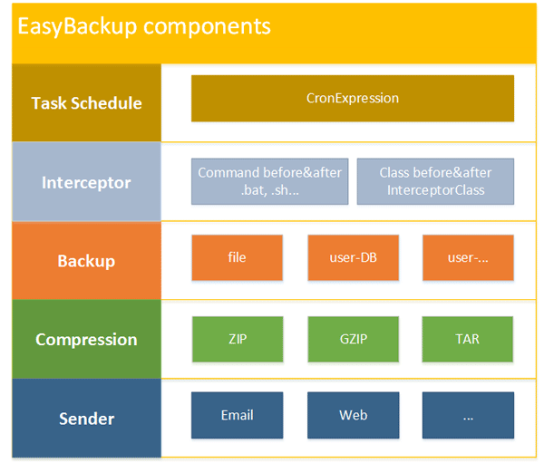
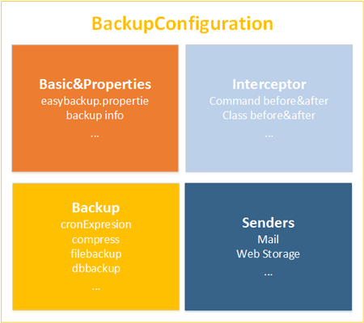
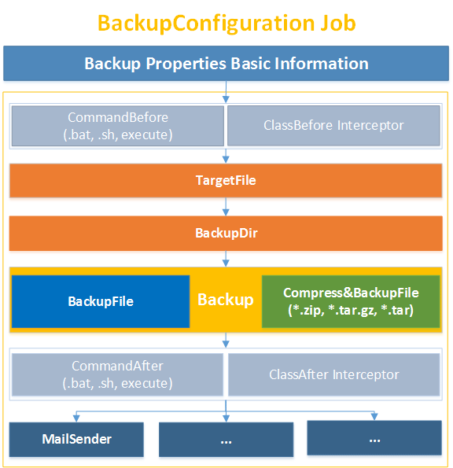
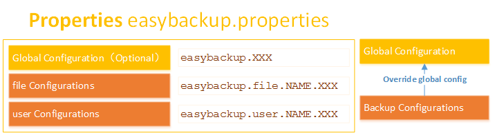
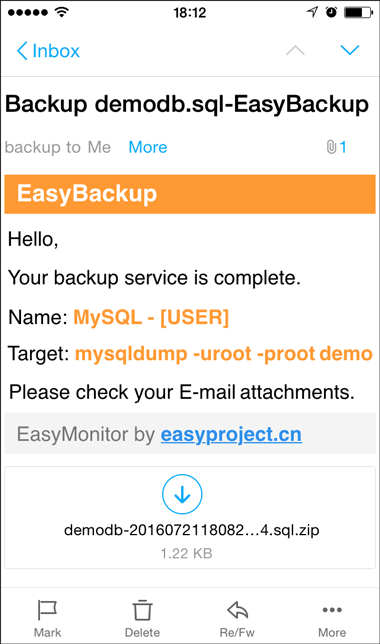

# EasyBackup

EasyBackup is a free open-source Java-based, cross-platform content backup, content compression, remote sending  task scheduling application and engine framework. Can run as application(**EasyBackup Application**), and can be extended as the content backup engine framework(**EasyBackup Engine Framework**).

 
EasyBackup provide full support for the need to backup the content. Collection of content-based task scheduling backups, content compression, remote sending, command execution and more. And all this, just a simple configuration management to complete.

**Latest version**: `3.2.0-RELEASE`

**Plugins**: 

- `easybackup-mysql-plugin-3.2.0-RELEASE.jar`  MySQL Databasse Backup plugin


### EasyBackup Web Manger

[EasyBackup Web Manger](https://github.com/ushelp/EasyBackup-Web "Goto EasyBackup Web Manger") is a Java Web Manager based on the EasyBackup framework Engine, you can complete the backup configuration, start and stop control.

## EasyBackup Feature

- **TThe content compression backup send Engine Framework out of the box can run**
- **Multiple optional compression format**. Support ` ZIP ` ` GZIP `, ` TAR ` format, etc 
- **Send remote backup**. Support will be sent to the mailbox backup, network storage, etc.
- **Flexible scheduling configuration**. It supports `CronExpression` monitoring task scheduling
- **Enhanced plug-in expansion**. Scalable database backup, and so achieve; custom target source file ( `TargetFile`) and backup file objects (` BackupDir`, `BackupFile`), custom backup achieve (` Backup`), custom interceptor ( `Interceptor` ), custom sender ( `Sender`).
- **Interceptor support**. Support command and a custom class based on the pre-post-interceptor
- **Custom notification templates**. Based on a custom template `freemarker` notification support built-in variables, update the template automatically reloaded
- **Heat load**. Support hot during operation to modify `easybackup.properties`, modify the monitoring configuration parameters without rebooting EasyBackup
- **Multiple directory support**. Which can backup files to multiple target directories
- **Multi-Service Support**. You can run multiple backup compression send service
- **Runtime feedback**. Get backup runtime infomation
- **Simple and flexible configuration**. 


## Easy Backup main components

- **Backup**
 Can be configured for `File` (file backup),` USER` (user-defined backup, such as database backups, and so on) are two types of backup services. Backup files directly to support backup compression and backup.

- **Compression**
 Support will target file compression as `ZIP`,` GZIP`, `TAR` other formats.

- **Sender**
 When the backup is complete, the results will be sent back up to `Email`,` Web Storage` and so on, a backup service can have multiple Sender.

- **Commander&Class Interceptor**
 Before and after the backup start and finish automatically execute the appropriate command to intercept and classes.

- **Task Schedule**
 `CronExpression` based backup task scheduling.




## BackupConfiguration

- **Backup term**:

 - `targetFile`: Destination file to be backed up
 
 - `dir`, `backupDir`: Backup file storage directory
 
 - `file`, `backupFile`: Backup file name


- **BackupConfiguration Object**

 It encapsulates the data required for each of the backup service and configuration information ( `basic`), complete configuration information (` properties`), scheduling information ( `task schedure`), interceptor information (` interceptor`), backup files information ( `targetFile`,` backupDir`, `backupFile`), compressed information (` compress`) and the sender ( `senders`).

 

- **BackupJob**
 
 Easy Backup based on `Backup Configuration` object, creating monitoring Job.

 

## Properties

`easybackup.properties` is EasyBackup core configuration files, configuration all the information required for the backup content.

### Configuration Structure
                                


### **Global configuration** (monitoring service as a global default configuration, optional)

```properties
# Backup ON or OFF, default is ON
easybackup.enable=ON

# Backup trigger Cron-Expressions
easybackup.cronexpression=0 30 * * * ?

# Directory to store the backup file
# You can specify more than one, separated by a ;
easybackup.dir=/user/backup/
# backup file name under 'easybackup.backup.dir' directory
# If not specified, the automatically generated file name is 'targetFileName-yyyyMMddHHmmssS[.zip|tar|tar.gz]'
# you can use variable: ${targetFileName}, ${name}, ${type}, ${value}, ${backuptime}, ${backupConfiguration.XXX}
easybackup.file=

# Whether backup compression, default is OFF
easybackup.compress=OFF
# Compression format: TAR(*.tar), ZIP(*.zip), GZIP(*.tar.gz), default is ZIP
easybackup.compressType=ZIP
# Comprssion encoding
easybackup.compressEncoding=

# Whether delete targetFile after backup complete, default is OFF
easybackup.deleteTargetFile=OFF

# Receive Backup file mail address
# You can specify more than one, separated by a ;
easybackup.mail.receiver=yourmail@domain.com;youmail2@domai2.org

# Send Mail Account Config
# Send Mail Account
easybackup.mail.sender=sendermail@domain.com
# Send Mail password
easybackup.mail.sender.passowrd=mailpassword
# Send Mail SMTP host
easybackup.mail.sender.host=smtp.163.com
# Send Mail SMTP port; default is 25
easybackup.mail.sender.port=25
# Send Mail Whether use SSL; default is false
easybackup.mail.sender.ssl=false
# Send Mail title
# you can use variable: ${targetFileName}, ${name}, ${type}, ${value}, ${backuptime?datetime}, ${backupConfiguration.XXX}
easybackup.mail.sender.title=Backup ${targetFileName}- EasyBackup
# The send mail content freemarker template in template directory, default is 'mail.tpl'
easybackup.mail.sender.template=mail.tpl

# Auto delete when send email complete ON or OFF, default is OFF
easybackup.mail.deleteBackup=OFF

# Execute Command when backup before or after
# You can specify more than one, separated by a ;
easybackup.cmd.before=
easybackup.cmd.after=

# Execute Interceptor when backup before or after
# You can specify more than one, separated by a ;
easybackup.beforeClass=
easybackup.afterClass=
```

### **Backup Service Configuration**(You can override the default global configuration)
- **file** File backup service configuration
- **user** Custom backup service configuration

`NAME` custom monitoring service name, each monitored service by a group of the same` NAME` configuration entries.


```properties
######################## Backup Service configuration
easybackup.[file|user].NAME=value
easybackup.[file|user].NAME.enable=ON | OFF
easybackup.[file|user].NAME.cronexpression=0/10 * * * * ?

easybackup.[file|user].NAME.dir=/user/backup/;/user/backup2
easybackup.[file|user].NAME.file=
easybackup.[file|user].NAME.compress=ON | OFF
easybackup.[file|user].NAME.compressType=ZIP | GZIP | TAR
easybackup.[file|user].NAME.compressEncoding=
easybackup.[file|user].NAME.deleteTargetFile=ON | OFF

easybackup.user.NAME.targetFileClass=package.YourTargetFile
easybackup.user.NAME.dirClass=package.YourBackupDir
easybackup.user.NAME.fileClass=package.YourBackupFile
easybackup.user.NAME.backupClass=package.YourBackup

easybackup.[file|user].NAME.cmd.before=/user/backupBefore.sh;/user/backupBefore2.sh
easybackup.[file|user].NAME.cmd.after=/user/backcAfter.sh;/user/backcAfter2.sh
easybackup.[file|user].NAME.beforeClass=package.BackupBefore;package.BackupBefore2
easybackup.[file|user].NAME.afterClass=package.BackupAfter;package.BackupAfter2

easybackup.[file|user].NAME.mail.receiver=receivermail@domain.com;receivermail1@domain.com

easybackup.[file|user].NAME.mail.sender=sendermail@domain.com
easybackup.[file|user].NAME.mail.sender.passowrd=sendermail_password
easybackup.[file|user].NAME.mail.sender.host=sendermail_host
easybackup.[file|user].NAME.mail.sender.port=sendermail_port
easybackup.[file|user].NAME.mail.sender.ssl=sendermail_ssh
easybackup.[file|user].NAME.mail.sender.title=sendermail_title
easybackup.[file|user].NAME.mail.sender.template=mail.tpl
easybackup.[file|user].NAME.mail.deleteBackup=ON | OFF

easybackup.[file|user].NAME.senders=package.userSenderClass;package.userSenderClass2
```

### User custom configuration instructions

- `targetFileClass`:  Get custom processing class of the target file, need to implement `TargetFile` interface, the default is ` cn.easyproject.easybackup.backup.file.impl.DefaultTargtFile`

- `dirClass`: Get custom backup directory handler class, need to implement `BackupDir` interface, the default is ` cn.easyproject.easybackup.backup.file.impl.DefaultBackupDir`

- `fileClass`: Get custom processing class backup filename, need to implement `BackupFile` interface, the default is `cn.easyproject.easybackup.backup.file.impl.DefaultBackupFile`

- `backupClass`: To complete the backup process to achieve class, need to implement `Badkup` interface, the default is `cn.easyproject.easybackup.backup.impls.FileBackup`


### Variables

- **Configuration backup file name**

  The default backup file named `${targetFileName}-yyyyMMddHHmmssS[.zip|tar|tar.gz]`, backup file name `Freemarker` can contain the following variables:

 ```
 ${targetFileName}: Target File name
 ${type}: Backup Type(FILE, USER)
 ${name}: Backup service NAME
 ${value}: Backup service value
 ${backuptime?string("yyyyMMddHHmmssS")}: BackupTime
 ${backupConfiguration.XXX}: BackupConfiguration Obejct
 ```

 Example:
  
 ```properties
 easybackup.file=${targetFileName}-${type}-${backuptime?string("yyyyMMddHHmmss")}.bkp
 easybackup.[file|user].NAME.file=file-${backuptime?string("yyyyMMddHHmmss")}.bkp
 ```


- **Mail Title Configuration**

 The message title may contain the following `Freemarker` variables:

 ```
 ${targetFileName}: Target File name
 ${backupFileName}: Backup File name
 ${type}: Backup Type(FILE, USER)
 ${name}: Backup service NAME
 ${value}: Backup service value
 ${backuptime?datetime}: BackupTime
 ${backupConfiguration.XXX}: BackupConfiguration Obejct
 ```

 Example:

 ```properties
 easybackup.mail.sender.title=Backup ${targetFileName}- EasyBackup
 easybackup.[file|user].NAME.sender.title=Backup ${targetFileName}- EasyBackup
 ```


## Examples of fully configured
```properties
######################## Global Config(Optional) 

# Backup ON or OFF, default is ON
easybackup.enable=ON

# Backup trigger Cron-Expressions
easybackup.cronexpression=0 30 * * * ?

# Directory to store the backup file
# You can specify more than one, separated by a ;
easybackup.dir=/user/backup/
# backup file name under 'easybackup.backup.dir' directory
# If not specified, the automatically generated file name is 'targetFileName-yyyyMMddHHmmssS[.zip|tar|tar.gz]'
# you can use variable: ${targetFileName}, ${name}, ${type}, ${value}, ${backuptime}, ${backupConfiguration.XXX}
easybackup.file=

# Whether backup compression, default is OFF
easybackup.compress=OFF
# Compression format: TAR(*.tar), ZIP(*.zip), GZIP(*.tar.gz), default is ZIP
easybackup.compressType=ZIP
# Comprssion encoding
easybackup.compressEncoding=

# Whether delete targetFile after backup complete, default is OFF
easybackup.deleteTargetFile=OFF

# Receive Backup file mail address
# You can specify more than one, separated by a ;
easybackup.mail.receiver=yourmail@domain.com;youmail2@domai2.org

# Send Mail Account Config
# Send Mail Account
easybackup.mail.sender=sendermail@domain.com
# Send Mail password
easybackup.mail.sender.passowrd=mailpassword
# Send Mail SMTP host
easybackup.mail.sender.host=smtp.163.com
# Send Mail SMTP port; default is 25
easybackup.mail.sender.port=25
# Send Mail Whether use SSL; default is false
easybackup.mail.sender.ssl=false
# Send Mail title
# you can use variable: ${targetFileName}, ${name}, ${type}, ${value}, ${backuptime?datetime}, ${backupConfiguration.XXX}
easybackup.mail.sender.title=Backup ${targetFileName}- EasyBackup
# The send mail content freemarker template in template directory, default is 'mail.tpl'
easybackup.mail.sender.template=mail.tpl

# Auto delete when send email complete ON or OFF, default is OFF
easybackup.mail.deleteBackup=OFF

# Execute Command when backup before or after
# You can specify more than one, separated by a ;
easybackup.cmd.before=
easybackup.cmd.after=

# Execute Interceptor when backup before or after
# You can specify more than one, separated by a ;
easybackup.beforeClass=
easybackup.afterClass=


########################  Backup Service Configuration 

############ File Backup(can override global config)
## format: 
## easybackup.file.NAME=value
## easybackup.file.NAME.enable=ON | OFF
## easybackup.file.NAME.cronexpression=0/10 * * * * ?
## easybackup.file.NAME.dir=/user/backup/;/user/backup2
## easybackup.file.NAME.file=
## easybackup.file.NAME.compress=ON | OFF
## easybackup.file.NAME.compressType=ZIP | GZIP | TAR
## easybackup.file.NAME.compressEncoding=
## easybackup.file.NAME.deleteTargetFile=ON | OFF
## easybackup.file.NAME.cmd.before=/user/backupBefore.sh;/user/backupBefore2.sh
## easybackup.file.NAME.cmd.after=/user/backcAfter.sh;/user/backcAfter2.sh
## easybackup.file.NAME.beforeClass=package.BackupBefore;package.BackupBefore2
## easybackup.file.NAME.afterClass=package.BackupAfter;package.BackupAfter2
## easybackup.file.NAME.mail.receiver=receivermail@domain.com;receivermail1@domain.com
## easybackup.file.NAME.mail.sender=sendermail@domain.com
## easybackup.file.NAME.mail.sender.passowrd=sendermail_password
## easybackup.file.NAME.mail.sender.host=sendermail_host
## easybackup.file.NAME.mail.sender.port=sendermail_port
## easybackup.file.NAME.mail.sender.ssl=sendermail_ssh
## easybackup.file.NAME.mail.sender.title=sendermail_title
## easybackup.file.NAME.mail.sender.template=mail.tpl
## easybackup.file.NAME.mail.deleteBackup=ON | OFF
## easybackup.file.NAME.senders=package.userSenderClass;package.userSenderClass2


# Example:
easybackup.file.LOG=D:/log
easybackup.file.LOG.enable=ON
easybackup.file.LOG.dir=D:/backup/logfile/;E:/backup/logfile
easybackup.file.LOG.cronexpression=0 30 * * * ?
easybackup.file.LOG.compress=ON
easybackup.file.LOG.compressType=ZIP
#easybackup.file.LOG.mail.receiver=mail@domain.com


############ Port Monitor(can override global config)
## format: 
## easybackup.user.NAME=value
## easybackup.user.NAME.enable=ON | OFF
## easybackup.user.NAME.cronexpression=0/10 * * * * ?
## easybackup.user.NAME.dir=/user/backup/;/user/backup2
## easybackup.user.NAME.file=
## easybackup.user.NAME.compress=ON | OFF
## easybackup.user.NAME.compressType=ZIP | GZIP | TAR
## easybackup.user.NAME.compressEncoding=
## easybackup.user.NAME.deleteTargetFile=ON | OFF
## easybackup.user.NAME.targetFileClass=package.YourTargetFile
## easybackup.user.NAME.dirClass=package.YourBackupDir
## easybackup.user.NAME.fileClass=package.YourBackupFile
## easybackup.user.NAME.backupClass=package.YourBackup
## easybackup.user.NAME.cmd.before=/user/backupBefore.sh;/user/backupBefore2.sh
## easybackup.user.NAME.cmd.after=/user/backcAfter.sh;/user/backcAfter2.sh
## easybackup.user.NAME.beforeClass=package.BackupBefore;package.BackupBefore2
## easybackup.user.NAME.afterClass=package.BackupAfter;package.BackupAfter2
## easybackup.user.NAME.mail.receiver=receivermail@domain.com;receivermail1@domain.com
## easybackup.user.NAME.mail.sender=sendermail@domain.com
## easybackup.user.NAME.mail.sender.passowrd=sendermail_password
## easybackup.user.NAME.mail.sender.host=sendermail_host
## easybackup.user.NAME.mail.sender.port=sendermail_port
## easybackup.user.NAME.mail.sender.ssl=sendermail_ssh
## easybackup.user.NAME.mail.sender.title=sendermail_title
## easybackup.user.NAME.mail.sender.template=mail.tpl
## easybackup.user.NAME.mail.deleteBackup=ON | OFF
## easybackup.user.NAME.senders=package.userSenderClass;package.userSenderClass2

# Example:
easybackup.user.MySQL=mysqldump -uroot -proot demoDB 
easybackup.user.MySQL.targetFileClass=cn.easyproject.easybackup.mysql.MySQLTargetFile
easybackup.user.MySQL.dir=D:/backup/;E:/backupdb
# default targetFileName is 'demoDB-yyyyMMddHHmmssS.sql'
# you can use variable: ${targetFileName}, ${name}, ${type}, ${value}, ${backuptime?string("yyyyMMddHHmmssS")}, ${backupConfiguration.XXX}
easybackup.user.MySQL.file= demodb-${backuptime?string("yyyyMMddHHmmss")}-backup.sql
easybackup.user.MySQL.compress=ON
easybackup.user.MySQL.compressType=ZIP
easybackup.user.MySQL.cronexpression=0 0 2 * * ?
#easybackup.user.MySQL.mail.receiver=mail@domain.com
```


## Mail template configuration

Easy Backup using `freemarker` mail content rendering technology template, the template must be stored in the directory` template`, `mail.tpl` default template.




### Custom template configuration

You can modify the template content, or fill in your own e-mail template to send.

```properties
### Global configuration
easybackup.mail.sender.template=yourmail.tpl

### Monitor Service configuration
easybackup.[file|user].NAME.mail.sender.template=yourmail.tpl
```

### Template built-in variables
```
${targetFileName}: Target File name
${backupFileName}: Backup File name
${type}: Backup Type(FILE, USER)
${name}: Backup service NAME
${value}: Backup service value
${backuptime?datetime}: BackupTime
${backupConfiguration.XXX}: BackupConfiguration Obejct
```


## EasBackup Application 

**EasBackup Application** can run as application. Configure your backup service as needed, can be activated.

EasyBackup Application already contains the current official and all plug-ins. If you develop a new plug-in, plug-in content can be added directly to the `easybackup-X.X.X-RELEASE-APPLICATION.jar` in.

### Plugins:

- `easybackup-mysql-plugin-3.2.0-RELEASE.jar`: **MySQL Database backup plugin**

### Steps for usage
 
1. **Configuration Backup Service**

 `easybackup.properties` the reference sample, configure your backup service.

2. **Run EasyBackup**

 - **Windows**(Sometimes you must '`Run as Administrator`')
 
   ```
   Start:  startup.bat
   Stop:   shutdown.bat
   ```

 - **Linux** 
 
   ```
   Start:  ./startup.sh
   Stop:   ./shutdown.sh
   ```

3. **Optional**
  1. **Mail template**  
  
     edit '`template/mail.tpl`' to custom your mail content.

  2. **Logger**  
  
     configuration `log4j.properties` log out. 


## EasyBackup Engine Framework

EasyBackup  is also a free open source cross-platform Java content backup engine frame (**EasyBackup Engine Framework**), to provide a unified and standard core configuration and backup scheduling.

### Steps for usage

1. Maven dependency

 ```XML
 <dependency>
     <groupId>cn.easyproject</groupId>
     <artifactId>easybackup</artifactId>
     <version>3.2.0-RELEASE</version>
 </dependency>
 ```

2. Custom interface

3. Configuration `easybackup.properties`

4. Start  
  ```JAVA
  public static void main(String[] args) {
      new EasyBackup().start();
  }
  ```
  
### Custom Interface

EasyBackup provides great flexibility, expandability following interfaces, you can customize your backup content:

- **TargetFile target file source**（`cn.easyproject.easybackup.backup.file.TargetFile`）
  
  **return**: custom `java.io.File` target file

  **configuration**: `easybackup.user.NAME.targetFileClass`

  **default**: `cn.easyproject.easybackup.backup.file.impl.DefaultTargtFile`

- **BackupDir backup directory**（`cn.easyproject.easybackup.backup.file.BackupDir`）
  
  **return**: custom `java.io.File` storage backup file directory

  **configuration**: `easybackup.user.NAME.dirClass`

  **default**: `cn.easyproject.easybackup.backup.file.impl.DefaultBackupDir`

- **BackupFile backup file name**（`cn.easyproject.easybackup.backup.file.BackupFile`）
  
  **return**: custom `String` backup file name

  **configuration**: `easybackup.user.NAME.fileClass`

  **default**: `cn.easyproject.easybackup.backup.file.impl.DefaultBackupFile`

- **Backup backup implement**（`cn.easyproject.easybackup.backup.impls.Backup`）
  
  **return**: According to information passed back up files, custom backup processing implementation, returns whether the backup was successful

  **configuration**: `easybackup.user.NAME.backupClass`

  **default**: `cn.easyproject.easybackup.backup.impls.FileBackup`

- **BackupBefore before interceptor**（`cn.easyproject.easybackup.backup.interceptor.BackupBefore`）

  **return**: Returns whether to continue the backup

  **configuration**: `easybackup.user.NAME.beforeClass`

  **default**: 

- **BackupAfter after interceptor**（`cn.easyproject.easybackup.backup.interceptor.BackupAfter`）

  **return**: 

  **configuration**: `easybackup.user.NAME.afterClass`

  **default**: 

- **Sender**（`cn.easyproject.easybackup.sender.Sender`）

  **return**: 

  **configuration**: `easybackup.[file|user].NAME.senders`

  **default**: 

### Custom Properties File and Freemarker Configuration object
To provide more flexibility, EasyBackup permit before starting backup service ** custom Properties File object** ( `easybackup.properties`) and ** mail to send Freemarker Configuration object** (` Configuration`).


```JAVA
// Custom Properties File
EasyBackup.setPropertiesFile(java.io.File propertiesFile);

// Custom mail to send Freemarker Configuration object
MailSender.setFreemarkerConfiguration(freemarker.template.Configuration configuration);
```

Example:

```JAVA
// Custom EasyBackup initialization Parameter

// Custom Properties File
Resource res = new ServletContextResource(sce.getServletContext(), "/easybackup.properties"); 
try {
    // Properties File 
    EasyBackup.setPropertiesFile(res.getFile());
} catch (IOException e) {
    e.printStackTrace();
}

// Custom mail to send Freemarker Configuration object
Configuration cfg= new Configuration(Configuration.VERSION_2_3_23);
cfg.setTemplateExceptionHandler(TemplateExceptionHandler.RETHROW_HANDLER);
cfg.setDefaultEncoding("UTF-8");
cfg.setServletContextForTemplateLoading(sce.getServletContext(), "/template");
// MailSender Configuration
MailSender.setFreemarkerConfiguration(cfg);
```

### Runtime access to information

`cn.easyproject.easybackup.BackupRuntime` providing information backup runtime.

```
# Backup controller
start()
stop()

# Information when started
started: Wheter started
allBackupsOnStartup
runningBackupsOnStartup
errorJobBackupsOnStartup

# Configuration information
getBackupNames(): All configuration names
getBackupsConfigurations(): All configuration objects
getEnableBackupsConfigurations(): All enable（enable=ON） configuration objects
getGlobalBackupsConfiguration(): Global Configuration object
getProperties(): Properties object
getPropertiesFile(): Properties File object
```


## EasyBackup Web Manger

[EasyBackup Web Manger](https://github.com/ushelp/EasyBackup-Web "Goto EasyBackup Web Manger") is a Java Web Manager based on the EasyBackup framework Engine, you can complete the backup configuration, start and stop control.


## End

[The official home page](http://www.easyproject.cn/easybackup/en/index.jsp 'The official home page')

[Comments](http://www.easyproject.cn/easybackup/en/index.jsp#donation 'Comments')

If you have more comments, suggestions or ideas, please contact me.

Email：<inthinkcolor@gmail.com>

[http://www.easyproject.cn](http://www.easyproject.cn "EasyProject Home")


We believe that the contribution of each bit by bit, will be driven to produce more and better free and open source products a big step.

**Thank you donation to support the server running and encourage more community members.**

[](https://www.paypal.me/easyproject/10 "Make payments with PayPal - it's fast, free and secure!")

