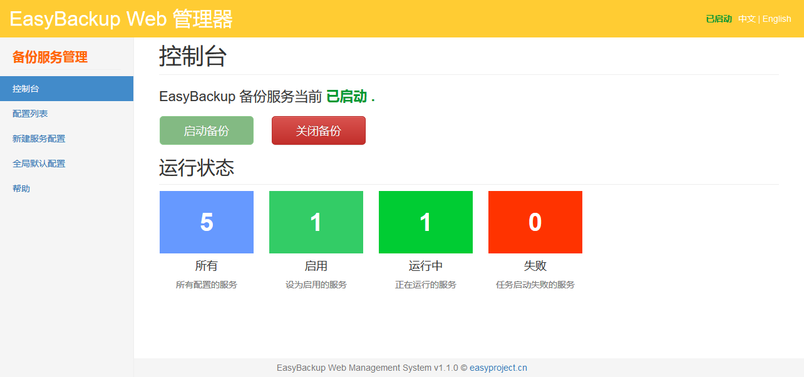

# EasyBackup


基于 Java 的免费开源跨平台内容备份，压缩，远程发送一体化任务调度应用及引擎框架。


A free, open source, cross-platform content backup, content compression,  remote sending task scheduling application integration framework and engine based on Java.


## 中文

EasyBackup 是一个基于 Java 的免费开源跨平台内容备份压缩远程发送一体化任务调度应用及引擎框架。即可开箱即用(**EasyBackup Application**)，又可以作为内容备份引擎框架扩展(**EasyBackup Engine Framework**)。

EasyBackup 能够为需要进行内容备份的程序场景提供一体化支持。集合了基于任务调度的内容备份，内容压缩，远程发送，命令执行等等功能。而这一切，仅需进行简单的配置管理即可完成。

**最新版本**： `3.2.0-RELEASE`

**插件**：

- `easybackup-mysql-plugin-3.2.0-RELEASE.jar`  MySQL 数据库备份插件


[中文说明文档](doc/readme_zh_CN.md)

[官方主页](http://www.easyproject.cn/easybackup/zh-cn/index.jsp '官方主页')

[留言评论](http://www.easyproject.cn/easybackup/zh-cn/index.jsp#donation '留言评论')

如果您有更好意见，建议或想法，请联系我。


## English

EasyBackup is a free open-source Java-based, cross-platform content backup, content compression, remote sending  task scheduling application and engine framework. Can run as application(**EasyBackup Application**), and can be extended as the content backup engine framework(**EasyBackup Engine Framework**).

 
EasyBackup provide full support for the need to backup the content. Collection of content-based task scheduling backups, content compression, remote sending, command execution and more. And all this, just a simple configuration management to complete.


**Latest version**: `3.2.0-RELEASE`

**Plugins**: 

- `easybackup-mysql-plugin-3.2.0-RELEASE.jar`  MySQL Databasse Backup plugin

[English Readme](doc/readme_en.md)

[The official home page](http://www.easyproject.cn/easybackup/en/index.jsp 'The official home page')

[Comments](http://www.easyproject.cn/easybackup/en/index.jsp#donation 'Comments')

If you have more comments, suggestions or ideas, please contact me.


## Maven

```XML
<!-- EasyBackup Engine Framework Maven dependency -->
<dependency>
   <groupId>cn.easyproject</groupId>
   <artifactId>easybackup</artifactId>
   <version>3.2.0-RELEASE</version>
</dependency>

<!-- EasyBackup Plugins -->
<!-- Based on the EasyBackup mysql database backup plugin Maven dependency -->
<dependency>
   <groupId>cn.easyproject</groupId>
   <artifactId>easybackup-mysql</artifactId>
   <version>3.2.0-RELEASE</version>
</dependency>
```


## EasyBackup Web Manger

[EasyBackup Web Manger](https://github.com/ushelp/EasyBackup-Web "移步 EasyBackup Web Manger") 是一个基于 EasyBackup 框架引擎的 Java Web 管理器，可以在 Web UI 下完成备份配置管理，备份启动，停止控制。



[EasyBackup Web Manger](https://github.com/ushelp/EasyBackup-Web "Goto EasyBackup Web Manger") is a Java Web Manager based on the EasyBackup framework Engine, you can complete the backup configuration, start and stop control.


## End

Email：<inthinkcolor@gmail.com>

[http://www.easyproject.cn](http://www.easyproject.cn "EasyProject Home")


**Donation/捐助:**

<a href="http://www.easyproject.cn/donation">
</img></a>
<div>支付宝/微信/QQ/云闪付/PayPal</div>

<br/>

我们相信，每个人的点滴贡献，都将是推动产生更多、更好免费开源产品的一大步。

**感谢慷慨捐助，以支持服务器运行和鼓励更多社区成员。**

We believe that the contribution of each bit by bit, will be driven to produce more and better free and open source products a big step.

**Thank you donation to support the server running and encourage more community members.**
